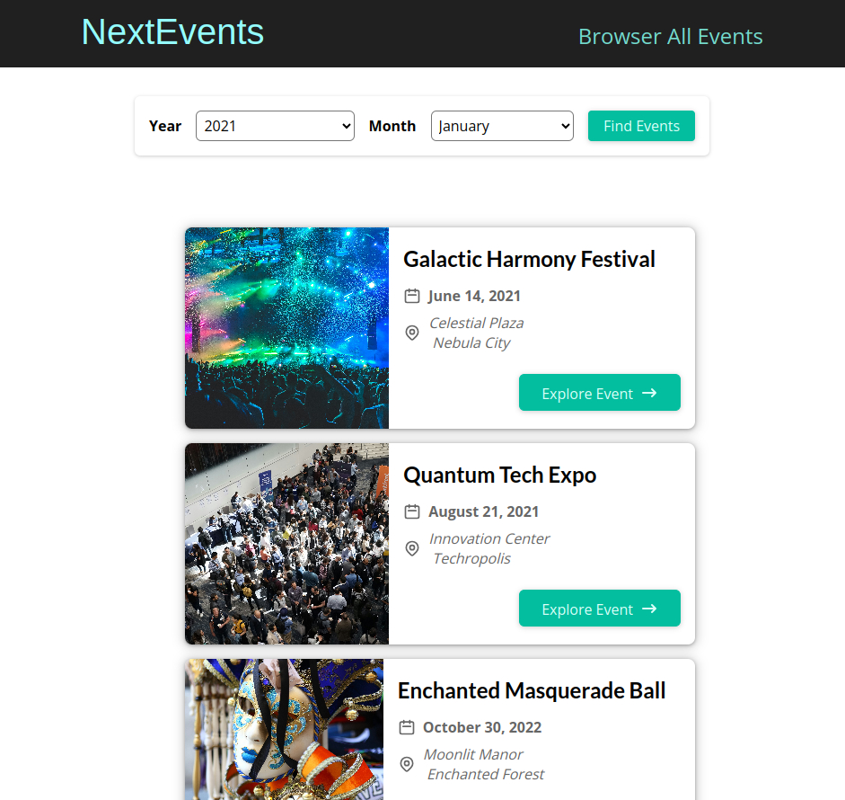

<h1>Next Events</h1>
<h4>
    É uma plataforma desenvolvida para praticar conceitos do Next.js. A aplicação visa fornecer aos usuários informações sobre eventos relevantes em sua região, facilitando assim o planejamento do lazer, mostrando opções variadas de entretenimento.
</h4>

<h3>Como Executar a Aplicação:</h3>

Siga os passos abaixo para executar o projeto localmente:

 

<h4>Pré-requisitos</h4>

Certifique-se de ter o Node.js instalado em sua máquina.

 

<h4>Passos</h4>

 

<strong>Clone o Repositório:</strong>

https://github.com/DilleyAndrade/next-events.git

 

<strong>Instale as Dependências:</strong>

npm install

 

<strong>Inicie a Aplicação:</strong>

npm run dev

 

<strong>Acesse a Aplicação:</strong>

Abra seu navegador e acesse http://localhost:3000.

Agora, você deve ter a aplicação em execução localmente em seu ambiente de desenvolvimento.

<h4>Contribuições</h4>

  Contribuições são bem-vindas! Se você deseja melhorar ou adicionar novos recursos, sinta-se à vontade para enviar um email para mim em dilleyandrade@gmail.com.

<h4>Licença</h4>

Este projeto é licenciado sob a Licença MIT.

Divirta-se.

